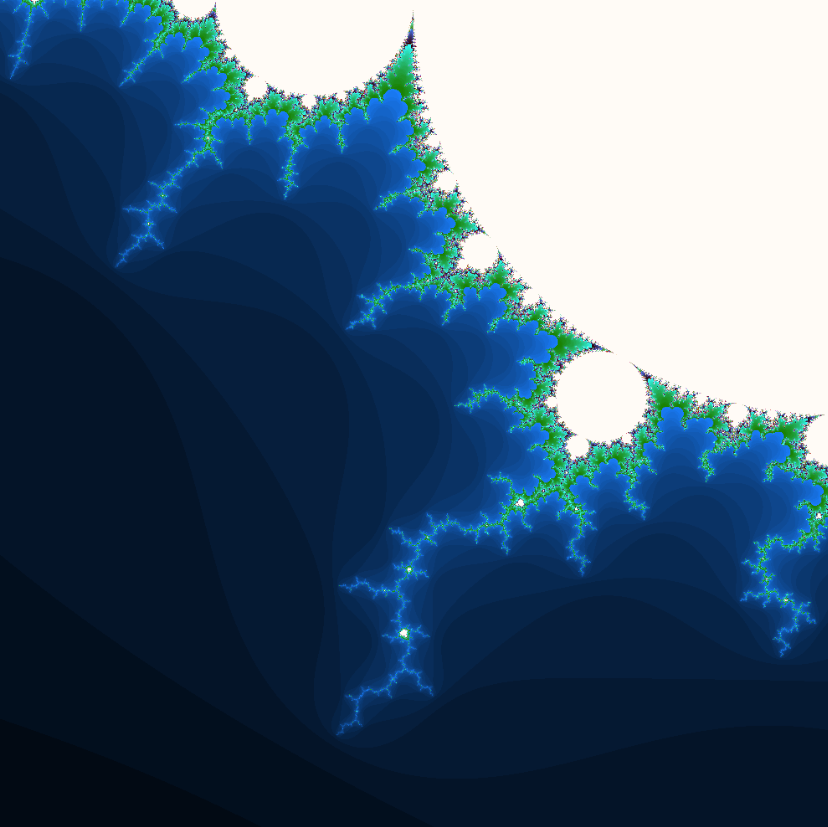
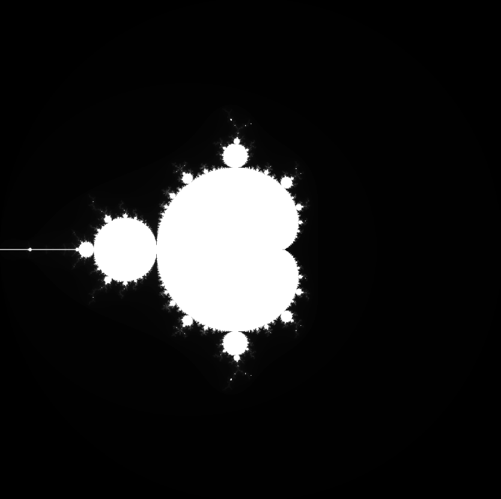

# C++ Graphics & Fractal Generator

## Project Overview
This is an object-oriented C++ project designed to generate images from scratch. It handles drawing geometric shapes and calculating complex fractals, saving the final results as PPM image files.

## Features
* **Fractal Generation:** Uses complex mathematics (`complexmatrix.h`) to render the Mandelbrot set (`mandelbrot.ppm`).
* **Canvas Management:** Custom canvas classes (`canvas.h`, `smartcanvas.h`) control the drawing area and pixel manipulation.
* **Color Handling:** Manages RGB values and pixel grids (`rgb.h`, `rgbmatrix.h`).
* **Shape Drawing:** Object-oriented structure for drawing basic geometric shapes (`drawable.h`, `shapes.h`).

## Technologies Used
* **Language:** C++
* **Paradigm:** Object-Oriented Programming (OOP)
* **Output:** PPM (Portable Pixmap) image format
## Generated Output
Here are examples of images generated by this project:

